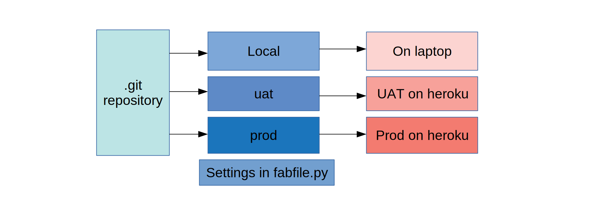

fab_support
===========

.. image:: https://img.shields.io/pypi/v/fab_support.svg
        :target: https://pypi.python.org/pypi/fab_support

.. image:: https://img.shields.io/travis/drummonds/fab_support.svg
        :target: https://travis-ci.org/drummonds/fab_support

.. image:: https://readthedocs.org/projects/fab-support/badge/?version=latest
        :target: https://fab-support.readthedocs.io/en/latest/?badge=latest
        :alt: Documentation Status

.. image:: https://pyup.io/repos/github/drummonds/fab_support/shield.svg
     :target: https://pyup.io/repos/github/drummonds/fab_support/
     :alt: Updates

Code to implement staging in Fabric and recipes for using that staging for pelican deployments and Django to Heroku.
It supports a local .env file importing for storing secrets that you don't want to store in git.

Stages
---------
Stages are the different stages of development of an application.
So they might go from:

test -> uat -> production -> old production

    Different stages of a single project

I have create a fab-support.py which does the heavy lifting of creating each environment.  The aim is that this should
be hardly any more than the use of fabric and much simpler than the use of a full featured build Salt_ or Ansible_.  This
is really only if you fit one of the use cases.  Like Ansible this is a simple single master deployment system.

.. _Salt: https://saltstack.com/
.. _Ansible: https://www.ansible.com/

Suitable use cases:

    - Deployment of Pelican static website
        - Deployment to local file system for use with a file server
        - Deployment to local for a file based browser
        - Deployment to S3

    - Simple Django to Heroku where you have at a minimum two stages eg UAT and Production.
        - Copes with Postgres database
        - Static data in AWS

In the root fabfile create a dictionary like this which
documents how to deploy each stage:

.. code-block:: python

    from fabric.api import env

    # Definition of different environments to deploy to
    env['stages'] = {
        'localsite': {
            'comment': 'stage: For serving locally on this computer via mongoose. ',
            'config_file': 'local_conf.py',
            'destination': 'C:/Sites/local.drummond.info',
            'copy_method': copy_file,
            'SITEURL': 'http://localhost:8042',
        },
        'production': {
            'comment': 'stage: For serving on local file server',
            'destination': '//10.0.0.1/web/www.drummond.info',
            'config_file': 'local_conf.py',
            'copy_method': copy_file,
            'SITEURL': 'http://www.drummond.info',
    },
    }

Then the deployment by Pelican is pretty standardised eg build deploy and you have commands such as:

`fab localsite deploy`

I think it was inspired by BreytenErnsting_.  This is then reiplmeneted using the standard env environment
and support in Fabric.

.. _BreytenErnsting: http://yerb.net/blog/2014/03/03/multiple-environments-for-deployment-using-fabric/

* Free software: MIT license
* Documentation: https://fab-support.readthedocs.io.

Django configuration
====================

The Django configuration includes the following features:
    - deployment to Heroku
    - Celery support with aqmp
    - Log trapping support with Papertrail

Features
--------
Runs on Windows.  If it is getting to complex then it should probably be ported to Ansible or Salt.

Levels of fabfile in this module
--------------------------------
In this module I use three levels of fabfile.py:

- At the project root
- at the /tests root
- at a test/demo level

This can get confusing, however they operate at different levels.  The project is about project operations eg
releasing to fab_support to pypi.

The tests level is then about managing the tests.  Some of these tests use fab support and a fabfile.py which gives you
the third level of nesting.

Project level fabfile
~~~~~~~~~~~~~~~~~~~~~
This is used to do work on the distribution:

- Make deocumentation
- build wheels
- deploy wheels to the package manager

At the tests level
~~~~~~~~~~~~~~~~~~~~~
This is used to run local commands.  Often the commands will be run from the test fab file level and then `lcd` to the
demo level.

At the tests/demo level
~~~~~~~~~~~~~~~~~~~~~~~
This is a model fabric file- however it is not like a normal one in that fab_support is not installed in the environment
and in fact is located at `../../fab_support`.

Credits
-------

This package was created with Cookiecutter_ and the `audreyr/cookiecutter-pypackage`_ project template.  Thanks Audrey

.. _Cookiecutter: https://github.com/audreyr/cookiecutter
.. _`audreyr/cookiecutter-pypackage`: https://github.com/audreyr/cookiecutter-pypackage

